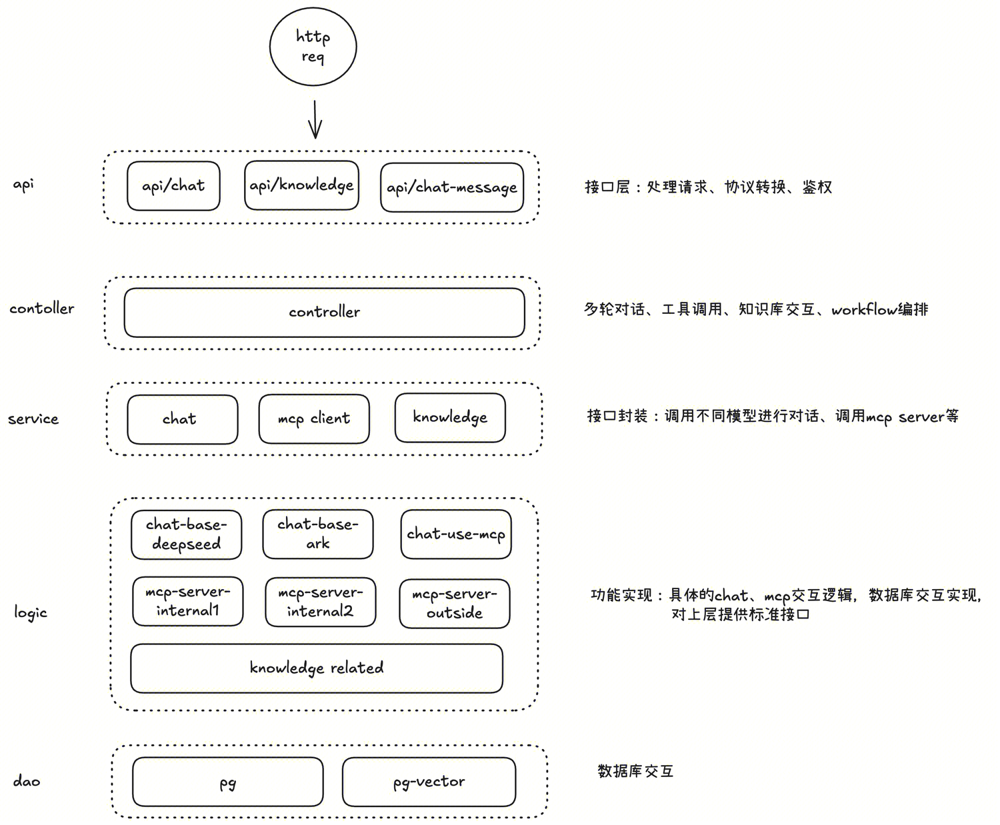
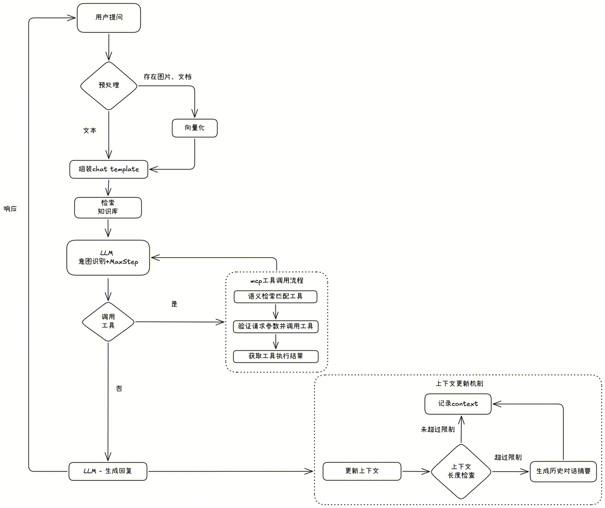

# 技术方案（草稿）
## 1. 需求概述

## 2. 架构设计

### 2.1 技术栈分层结构
| 层级 | 核心功能 | 职责说明 |
|------|----------|----------|
| API接入层 | GoFrame HTTP Server、鉴权 | 处理HTTP请求，进行协议转换、认证与过滤 |
| Agent核心服务层 | Eino框架（Chain/Graph编排、ChatModel、Tool、Retriever） | 执行Agent的推理、工具调用、多轮对话管理等核心逻辑 |
| 业务逻辑层 | GoFrame Service模块、自定义业务逻辑 | 处理用户会话、知识库管理、插件注册等业务规则 |
| 数据访问层 | GoFrame ORM（pg、pg-vector） | 提供结构化数据、缓存、向量数据的持久化能力 |

对应的GoFrame分层架构

### 2.2 核心模块交互流程

## 3. 核心模块详细设计
### 3.1 接口与数据库表设计
#### 3.1.1 接口定义

#### 3.1.2 库表设计

### 3.2 多轮对话与记忆系统
#### 3.2.1 上下文管理
- 短期记忆实现
- 对话状态跟踪
- 上下文窗口实现

#### 3.2.2 长期记忆架构
- 用户特征存储
- 历史对话向量化
- 知识库集成

### 3.3 知识库管理
- 文档解析
- 向量化存储
- 增量更新

### 3.4 MCP server与工具调用

### 3.5 多Agent协作框架

### 3.6 评价模型与内容优化